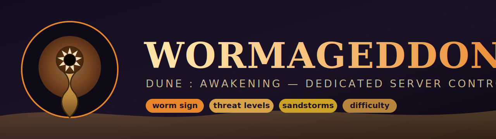

<p align="center">
  
</p>

<p align="center">
  <a href="LICENSE"></a>
  
  
  
</p>

# Wormageddon

> A dead-simple, zero-install **command center** for a self-hosted
> **Dune: Awakening** dedicated server — tune the worms, manage the server, and
> run live in-game admin, all from one window.

Drag a few sliders, hit **APPLY + RESTART**, and the desert gets scarier (or
calmer). Wormageddon edits the persistent `UserGame.ini` overrides on your Dune
server over SSH and restarts the affected shard so the change takes effect — no
agent to install on the server, no service to host, no database to wire up. Just
two PowerShell files on your Windows box.

Its heart is the dials that make sandworms and the world *feel* different: how
aggressively worms hunt you, how much "threat" each action generates, how dense
the worms are, when the giant **Shai-Hulud** erupts, plus storm / harvest /
day-length knobs. Around that it adds a **Server** tab (status, players,
start / stop / restart / update) and an **Admin** tab (live in-game commands —
broadcast, give item, teleport, kick, award XP, spawn vehicle), so one window
covers day-to-day operation of a solo server.

> [!IMPORTANT]
> **Unofficial fan tool.** Wormageddon is not affiliated with, endorsed by, or
> supported by Funcom. "Dune: Awakening" and "Shai-Hulud" are trademarks of
> their respective owners. It edits live server config and **restarts shards
> (dropping players on them)** — read [docs/SAFETY.md](docs/SAFETY.md) first and
> use at your own risk.

---

## Why this exists

The big community admin tools — [adainrivers/dune-dedicated-server-manager](https://github.com/adainrivers/dune-dedicated-server-manager)
(server lifecycle + in-game admin) and [Icehunter/dune-admin](https://github.com/Icehunter/dune-admin)
(a full multi-provider web panel) — are excellent and do *far* more than this
project — with multi-user web UIs, Discord auth, battlepass/market, and every
hosting topology. Wormageddon aims narrower: a **zero-install, single-operator
command center on Windows** covering what one admin actually reaches for — worm/
threat tuning (its specialty), server lifecycle, and live in-game admin — with
nothing to host and no paid dependencies. Want multi-user/community features?
Use those. Want to run your own server solo from one window? You're set here.

See the honest, detailed three-way breakdown in [docs/COMPARISON.md](docs/COMPARISON.md).

---

## How it works

There is **no game API** for these settings. They are Unreal Engine 5 `*.ini`
overrides that the server reads when a shard starts. So the entire trick is:

```
 Your Windows PC                         Dune server VM (Alpine + k3s)
 ┌───────────────────┐   SSH (key)   ┌────────────────────────────────────────┐
 │ Wormageddon-GUI   │ ────────────▶ │  sudo k3s kubectl exec <shard pod> ...  │
 │   (sliders)       │               │     │                                   │
 │ Wormageddon.ps1   │               │     ├─ back up UserGame.ini             │
 │   (CLI engine)    │               │     ├─ merge your change into it        │
 └───────────────────┘               │     └─ delete the pod  → shard restarts │
                                      │        (re-reads UserGame.ini on boot)  │
                                      └────────────────────────────────────────┘
```

1. **SSH** to the Dune VM using the key the Dune Dedicated Server Manager already
   generated for you.
2. **`kubectl exec`** into the running shard pod and edit
   `…/DuneSandbox/Saved/UserSettings/UserGame.ini` (a timestamped backup is
   written to `.\backups` first, every time).
3. **Restart that one shard** so the server re-reads the file.

Full details in [docs/ARCHITECTURE.md](docs/ARCHITECTURE.md).

> [!NOTE]
> **Sandworms repopulate ~10 minutes after *any* restart.** "No worms right
> after a restart" is normal — use the GUI's **Worms?** button (or
> `Wormageddon.ps1 worms`) to check warm-up.

---

## Requirements

- **Windows** with PowerShell **5.1+** (built in) — and the OpenSSH client
  (`ssh.exe`, built into Windows 10/11). Password auth instead of a key needs
  [PuTTY/plink](https://www.putty.org); a key is strongly recommended.
- A **Dune: Awakening dedicated server** on the Funcom `igw` platform (Alpine +
  single-node k3s) — the kind the
  [Dune Dedicated Server Manager](https://github.com/adainrivers/dune-dedicated-server-manager)
  provisions — reachable from your PC over SSH, with the game user able to run
  `sudo k3s kubectl`.

---

## Get it

**Download** the latest [release](https://github.com/SetsuaD/DuneAwakening-Wormageddon/releases/latest)
and unzip it, **or** clone:

```bat
git clone https://github.com/SetsuaD/DuneAwakening-Wormageddon.git
```

> [!NOTE]
> Wormageddon is **100% plain-text PowerShell — there is no compiled `.exe`**.
> Every file is human-readable; you can (and should) read it before running it.

## Three ways to run it

It's just three `.bat` files in the folder — pick one:

| Double-click | What it does | Use when |
|---|---|---|
| **`Run-Portable.bat`** | Opens the GUI right now. Installs nothing, no shortcut, no admin. | You just want to use it. |
| **`Setup-Shortcut.bat`** | Adds a "Wormageddon" **Desktop shortcut** (and seeds the config file). Still runs from this folder. | You'll use it often and want a Desktop icon. |
| **`Build-From-Source.bat`** | **Lints, self-tests, validates, and zips** a clean build to `dist\`. | You want to review/verify the source and package it yourself. |

To uninstall, just delete the folder (and the Desktop shortcut, if you made one).
*(The classic `setup.bat` / `run_dev.bat` / `build.bat` names still work too — they
forward to the three above.)*

## Using the GUI

**Connect to Server** (first run — enter your server IP, SSH user `dune`, and your
SSH key file) → pick a **shard** → **Read current** (or load a **Preset**) → drag
sliders → **APPLY + RESTART**.

Prefer the command line? Everything the GUI does is available headless:

```powershell
# show current overrides on the survival shard
powershell -ExecutionPolicy Bypass -File .\Wormageddon.ps1 show

# crank the worms, then apply
.\Wormageddon.ps1 preset wormageddon
.\Wormageddon.ps1 restart -Shard Survival_1 -Yes

# or tune a single dial
.\Wormageddon.ps1 set Sandworm ThreatScale 2.0
.\Wormageddon.ps1 restart
```

---

## CLI reference

**Settings — worm/threat tuning:**

| Action | What it does |
|---|---|
| `status` | Battlegroup health + shards + players |
| `shards` | List the running map/shard names |
| `worms [-Shard S]` | Sandworm spawn count + shard uptime (warm-up check) |
| `show [-Shard S]` | Print the shard's current `UserGame.ini` overrides |
| `get <Key> [-Shard S]` | Show the game default **and** current override for a key |
| `set <Group> <Key> <Value> [-Shard S]` | Add/replace one override (merges; auto-backup) |
| `unset <Group> <Key> [-Shard S]` | Remove one override (revert that key to default) |
| `preset <Name> [-Shard S]` | Apply a curated bundle from `presets.json` (auto-backup) |
| `backup [-Shard S]` | Save a timestamped copy of `UserGame.ini` to `.\backups` |
| `restart [-Shard S] [-WarnSeconds N] [-Yes]` | Restart one shard so changes take effect (`-WarnSeconds N` warns players first) |

**Server — lifecycle & status:**

| Action | What it does |
|---|---|
| `players` | List players (name / online / id) |
| `commands` | List the live commands the daemon accepts |
| `start` · `stop` · `update` `[-Yes]` | Battlegroup lifecycle (disruptive — confirms first) |

**Admin — live in-game commands** (need the `dune-server-service` daemon on the VM):

| Action | What it does |
|---|---|
| `broadcast "<msg>" ["<title>"]` | On-screen message to all players |
| `give <PlayerId> <ItemName> [Qty]` | Grant an item |
| `xp <PlayerId> <Amount>` | Award XP |
| `kick <PlayerId>` | Kick a player (`*` = everyone) |
| `teleport <PlayerId> <X> <Y> <Z>` | Teleport a player |
| `spawn <PlayerId> <ClassName> <X> <Y> <Z>` | Spawn a vehicle |
| `publish <Command> '<json>'` | Send any daemon command (escape hatch) |
| `ssh "<cmd>"` | Raw shell command on the VM (advanced/debug) |

Add **`-DryRun`** to preview any command's exact payload without sending; **`-Yes`**
skips confirmations. Full daemon + command details: [docs/LIVE-COMMANDS.md](docs/LIVE-COMMANDS.md).

**Groups** map to UE5 ini sections: `Sandworm`, `TimeOfDay`, `Building`,
`GameMode`, `Pvp`, `Security`, `Storm`, `Harvest`, `FlourSand`, `Hydration`
(or pass a full `/Script/...` section name).

---

## The dials (worm sign & threat highlights)

These live in the **Sandworm** group (`[/Script/DuneSandbox.SandwormSettings]`).
The full per-action **threat matrix** (walking / running / crouching / sprinting /
hyper-sprinting / dashing / suspensor-hover / shielding / vehicle-shield /
drum-sand), the giant-worm block, storms, harvest, day length, hydration, and the
PvP-drop dial are all in [docs/SETTINGS_REFERENCE.md](docs/SETTINGS_REFERENCE.md)
— **every key and default there is verified against the live shipped
`DefaultGame.ini`.** There's also a master `m_EnableSandwormSystem` toggle
(CLI-only, since it's an enum).

| Setting | Default | What it does |
|---|---:|---|
| `ThreatScale` | 1.0 | **Master multiplier on all worm threat.** The single biggest dial. |
| `DefaultMaxThreatScore` | 5000 | Threat that must build before a worm commits to attack. Lower = strikes sooner. |
| `WalkingThreatPerSec` | 15 | "Worm sign" generated per second while walking… |
| `SprintingThreatPerSec` | 20 | …sprinting… |
| `DashingThreatPerSec` | 90 | …dashing (a sharp spike)… |
| `ShieldingThreatPerSec` | 500 | …and with a Holtzman shield up on foot (a worm magnet). |
| `m_MinDistanceBetweenSandworms` | 80000 | Worm spacing (cm). Lower = denser worm population. |
| `m_bGiantWormSystemEnabled` | On | Master toggle for the scripted giant worm (Shai-Hulud). |
| `m_GiantWormMinimumPlayersOnSpiceField` | 4 | Harvesters needed to trigger Shai-Hulud. `1` = anyone can summon it. |

### Presets (`presets.json`)

| Preset | Vibe |
|---|---|
| `calm` | Relaxed worms — sparse, slow to provoke, forgiving. |
| `standard` | The game's default worm behaviour. |
| `wormageddon` | Maximum threat — dense, hair-trigger, summonable giant worm. |

Presets are plain JSON; copy a block to make your own. There's also a one-click
**SUMMON SHAI-HULUD** button in the GUI that makes the giant worm callable on
demand by a single spice harvester.

---

## Safety

- Every `set`/`unset`/`preset` writes a **timestamped backup** of `UserGame.ini`
  to `.\backups` before changing anything.
- **A restart drops the players on that shard** (~1 minute). Use an empty window
  or warn them. The CLI asks for confirmation unless you pass `-Yes`.
- `dune-connection.json` (your server IP, key path, optional password) is
  **git-ignored** — it never leaves your PC.
- **Warn players before you restart:** `restart -WarnSeconds 60` (or
  `broadcast "..."`) sends an in-game countdown so a worm-tuning restart isn't a
  surprise — optional, and needs the `dune-server-service` daemon on your server
  (see [docs/LIVE-COMMANDS.md](docs/LIVE-COMMANDS.md)).

More in [docs/SAFETY.md](docs/SAFETY.md).

---

## Credits & lineage

- Built for servers provisioned by **[adainrivers/dune-dedicated-server-manager](https://github.com/adainrivers/dune-dedicated-server-manager)**.
- The broader, more capable community web panel is **[Icehunter/dune-admin](https://github.com/Icehunter/dune-admin)** — worth a look if you outgrow this.
- The underlying server is **Funcom's `igw` self-hosting platform** for *Dune: Awakening*.

## Contributing

Issues and PRs welcome — especially new presets and corrections to the settings
reference. See [CONTRIBUTING.md](CONTRIBUTING.md).

## License

[MIT](LICENSE).
